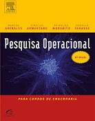

# Introdução à Pesquisa Operacional

-----

## Sobre esse material

Esses slides foram preparados com base em diversos materiais da literatura, em especial:

- [1] Profa. Maristela Oliveira dos Santos (ICMC/USP): "Introdução à Pesquisa Operacional - Otimização Linear", 2010.
- [2] Tutorial ilectures (https://igormcoelho.github.io/ilectures-pandoc/)


# O que é Pesquisa Operacional?


-----

## O que é pesquisa operacional?

**Pesquisa Operacional - PO** (pt-br), Investigação Operacional (pt), Operational Research (en-gb), Operations Research (en), Investigación Operativa (es), Recherche Opérationnelle (fr), ...

Da [Wikipedia](https://pt.wikipedia.org/wiki/Investiga%C3%A7%C3%A3o_operacional):

> "Ramo interdisciplinar da matemática aplicada que faz uso de modelos matemáticos, estatísticos e de algoritmos na ajuda à tomada de decisões".

-----

## Associações de PO no Brasil e no Mundo

- IFORS - International Federation of Operacional Research
Societies
- EURO - The Association of European Operational Research
Societes
- APDIO - Associação Portuguesa de Investigação Operacional.
- SOBRAPO - Sociedade Brasileira de Pesquisa Operacional

-----

## INFORMS Journals

Alguns journals do *Institute for Operations Research and the Management Sciences* (INFORMS): 

- Decision Analysis
- Information Systems Research
- INFORMS Journal on Computing
- INFORMS Transactions on Education
- Management Science
- Manufacturing & Service Operations Management
- Marketing Science
- Mathematics of Operations Research
- Operations Research
- Organization Science
- Service Science
- Transportation Science

-----

## Onde pode ser aplicada?

- Pode ser aplicada a problemas onde é necessário especificar, de forma quantitativa, a condução e a coordenação das operações ou atividades dentro de uma organização.
- A natureza da organização pode ser financeira, industrial, militar, governamental, etc.

-----

## Tomada de decisões (escopo)

- (Em uma estrada) Qual o melhor caminho a tomar?
- (Na bolsa de valores) Em que companhias investir?
- (Em uma indústria) O que e em que ordem produzir?
- (Em um trabalho em grupo) Que pessoas alocar a que tarefas?
- (Em uma companhia de distribuição) Que rede (elétrica, de
gás, etc.) instalar?

# Um breve histórico da PO

------

## Um breve histórico da PO

- **1939-1945:** Durante a 2ª Guerra Mundial, as gerências
militares britânica e americana empregaram uma abordagem
científica para tratamento de problemas de gerenciamento de
recursos escassos (radares, tropas, munição, remédios etc.), de forma eficaz.
- **1936:** *British Military Applications* utilizaram o termo "operational research" (*en-gb*).
- **Problema:** Como usar radares? (Como aumentar a eficiência da informação fornecida por radares)

------

## Um breve histórico da PO

- Segunda Guerra Mundial: Problema: Tamanho dos comboios!
- O que é melhor usar ?
- vários comboios pequenos (mais rápidos)?
- poucos comboios grandes (mais protegidos)?

------

## II Guerra Mundial

- Melhoria das operações utilizadas:
- Operations research - Pesquisa Operacional


------

## Um breve histórico da PO

- 1947: Início do interesse das indústrias na utilização das técnicas desenvolvidas na área militar, para auxiliar no planejamento e controle da produção.
- A maioria desses problemas é formulada através de modelos
matemáticos lineares.

------

## Um breve histórico da PO


::::::::::::: {.columns}

::::: {.column width=40%}

{width=80%}

:::::

::::: {.column width=60%}


- 1949: George B. Dantzig apresenta o Método Simplex para
resolver problemas de otimização linear (equações e (ou)
inequações lineares).
- George B. Dantzig - propõe o Método Simplex enquanto
trabalhava como Consultor em Matemática no controle da
força aérea americana.
- mais datas( http://www.lionhrtpub.com/orms/orms-10-
02/frhistorysb1.html)


:::::


:::::::::::::

# Modelagem em PO

------

## Diagrama de um projeto de PO

![Modelo vs Mundo Real. Retirado de [1]](2020-06-22-22-54-18.png)


## teste plotly


<!-- BEGIN COMMENT -->

```python {cmd=true}
from figs.fig_plotly_canada import draw_fig
fig = draw_fig('figs/fig_plotly_canada.png')
```
<!-- @import "figs/fig_plotly_canada.png" -->

<!-- END COMMENT -->

Columns Part 1/3 (b)
Code Chunk executing on Atom
Columns Part 2/3
This is a Plotly figure

<!-- BEGIN COMMENT TO revealjs -->
\`\`\`{.plotly_python caption="This is a Plotly figure"}
from figs.fig_plotly_canada import draw_fig
fig = draw_fig('figs/fig_plotly_canada.png')
\`\`\`
<!-- END COMMENT TO revealjs -->


-------


## Boas vindas

Bem-vind@s ao curso de Pesquisa Operacional!

Curso:

- Pesquisa Operacional - `TCC00318` - C.H. 64
- Site: https://igormcoelho.github.io/curso-pesquisa-operacional-i

Links úteis:

- http://www.ic.uff.br/index.php/pt/curriculo-e-disciplinas/disciplinas-obrigatorias
- https://app.uff.br/graduacao/quadrodehorarios
- Instituto de Computação (IC/UFF) - www.ic.uff.br
- Universidade Federal Fluminense (UFF) - www.uff.br

--------

## Sobre mim


::::::::::::: {.columns}

::::: {.column width=40%}

{width=50%}

imcoelho at ic.uff.br (preferência)

igor.machado at gmail.com (emergência)

:::::

::::: {.column width=60%}

Me chamo Igor, e é um prazer apresentar esse curso para vocês! Sou professor e pesquisador da UFF, apaixonado pela área de pesquisa operacional, em especial, técnicas de otimização e meta-heurísticas (*ao final desse curso vocês também saberão bem o que é isso!*). Podem me contactar pelos emails ao lado (*substituam o 'at' por '@'*).
Esse curso está disponível no meu site pessoal no github: igormcoelho.github.io/curso-pesquisa-operacional-i


:::::


:::::::::::::

--------

## Sobre vocês

Gostaria que se apresentassem também (*nas aulas síncronas*) para nos conhecermos melhor!

Ninguém aprende 100% do que o professor ensina, e nem o professor consegue ensinar 100% de um conteúdo, então cabe aos alunos: *ler*, *estudar* e *questionar* (muito!). **Juntos** podemos trabalhar para transmitir esse conhecimento valioso para cada um de vocês.

Sempre que tiverem uma dúvida ou curiosidade, perguntem! Toda pergunta é valiosa, e o conhecimento é construído em pequenas porções.

-------

## Acordo Aluno-Professor

*Para esse curso funcionar: tenham dedicação!*

É fundamental:

- Não atrasar entrega de trabalho, mas caso precisem de uma extensão, solicitem antes do prazo! (*atrasos podem reduzir ou até zerar notas*)
- Buscar ao máximo não perder nenhuma aula (síncrona), e caso percam, busquem o quanto antes suprir esse conteúdo
- Nunca, em hipótese alguma, copiem um trabalho pronto! Além dos efeitos práticos (como perda de nota ou demais sanções previstas nas normas), não se enganem: quem mais perde é o aluno. Conhecimento é o bem mais valioso!
- Sempre citem as fontes, especialmente para trechos de textos. Sempre que possivel, indique a licença de uso de imagens e códigos (os buscadores permitem buscas com licença livre).


--------


## Contexto ACE

Atividades Acadêmicas Emergenciais (ACE)

- Definição de plano de trabalho: 26/06/2020

- Período: 29/06/2020 (segunda-feira) - 31/08/2020 (segunda-feira)

- Lançamento de notas: 31/08/2020

Teremos aulas síncronas no horários regulares, e devido ao período mais curto, teremos outras diversas atividades assíncronas complementares (vídeos, textos, trabalhos, ...) para suprir toda a carga horária.

---------

## Ementa

1. INTRODUÇÃO AOS CONCEITOS DE PESQUISA OPERACIONAL: ORIGEM, DESENVOLVIMENTO E ESTADO DA
ARTE;
2. PRINCIPAIS ÁREAS DA PESQUISA OPERACIONAL (PO);
3. CONCEITOS DE PROGRAMAÇÃO LINEAR, MODELAGEM, MÉTODOS;
4. CONCEITOS DE PROGRAMAÇÃO LINEAR INTEIRA, APLICAÇÕES;
5. ALGORITMOS HEURÍSTICOS E META-HEURÍSTICOS PARA PROBLEMAS DE OTIMIZAÇÃO COMBINATÓRIA;
6. SOFTWARES DE OTIMIZAÇÃO COMBINATÓRIA (CPLEX, XPRESS, ETC);
7. OUTROS TÓPICOS DE PESQUISA OPERACIONAL E SUAS APLICAÇÕES

--------

## Avaliação

Toda semana haverá atividades avaliativas assícronas (A), como listas de exercícios e resumos de textos/vídeos. Além disso, haverá uma prova escrita (E) e dois trabalhos de implementação (I), com apresentação.

A nota do curso será:

T = 30%A + 70%I

N = (E + T)/2

De acordo com as normas regulares da UFF, a nota mínima para aprovação é 6.

--------

## Cronograma

- Período: 29/06/2020 - 31/08/2020

Tipo = Sinc./Assinc.

| Data       | Atividade                       | Tipo   |
| :---       |   :----                         | :---   |
| 29/06/2020 |  Introdução à PO                |  Sinc. |
| 06/07/2020 |  (Meta-)Heurísticas Parte 1     |  Sinc. |
| 13/07/2020 |  Programação Linear e Inteira   |  Sinc. |
| 20/07/2020 |  *                              |  Sinc. |
| 27/07/2020 |  Prática                        |  Sinc. |
| 03/08/2020 |  Prova Escrita (E)              |  Sinc. |
| 10/08/2020 |  (Meta-)Heurísticas Parte 2     |  Sinc. |
| 17/08/2020 |  *                              |  Sinc. |
| 24/08/2020 |  Apresentação (I)               |  Sinc. |
| 31/08/2020 |  Lançamento Notas               |  Sinc. |


-------

## Ferramentas Necessárias

Para o andamento do curso e reprodução dos exemplos oferecidos, serão necessários alguns softwares, como:

- Python3 (preferência pela Anaconda3 com todos pacotes)
   * pacote `python-mip`: pip3 install python-mip
- Compilador C++ com suporte C++20 (GCC-10.1 ou clang-11)

No GNU/Linux, em especial família Debian/Ubuntu, a instalação é direta utilizando o sistema de pacotes `apt` ou executáveis providos nos respectivos sites dos projetos. No Windows é recomendado instalar versões nativas. Ou opção para utilizar os mesmos pacotes Linux no Windows, é utilizar o WSL para simular um terminal Ubuntu:

- Tutorial WSL (cortesia Anderson Zudio):
https://docs.google.com/document/d/1eHT19VPVyY3VlPT-820Ztf_rhZ4DORxaQDOZFdlDaus/edit?usp=sharing


--------

## Bibliografia Recomendada

::::::::::::: {.columns}

::::: {.column width=40%}

{width=50%}

:::::

::::: {.column width=60%}

Buscaremos suprir o conteúdo especialmente através de materiais com licença livre (slides, apostilas, vídeos, textos, ...). Como livro texto, recomendamos o livro: *"Arenales M.,  Armentano V., Morabito R., Yanasse H. Pesquisa Operacional. Rio de Janeiro: Editora Campus. (2007)"*.

:::::


:::::::::::::


# Agradecimentos

-----

## Software

Esse material de curso só é possível graças aos inúmeros projetos de código-aberto que são necessários a ele, incluindo:

- pandoc
- LaTeX
- GNU/Linux
- git
- markdown-preview-enhanced (github)
- visual studio code
- atom
- revealjs
- ...

-----

## Empresas

Agradecimento especial a empresas que suportam projetos livres envolvidos nesse curso:

- github
- gitlab
- microsoft
- google
- ...

-----

## Pessoas

Em especial, agradeço a colaboradores que tornaram esse material possível (em ordem alfabética):

- Anderson Zudio (tutorial)
- Haroldo Gambini (python-mip)
- Luiz Satoru Ochi (slides)
- Marcone Jamilson Freitas Souza (slides)
- Vitor Nazário Coelho (site)
- ...

-----

## Reprodução do material

Esses slides foram escritos utilizando pandoc, segundo o tutorial ilectures:

- https://igormcoelho.github.io/ilectures-pandoc/

Licença: Creative Commons 2020

Igor Machado Coelho
