# Modelagem em Pesquisa Operacional

-----

## Sobre esse material

Esses slides foram preparados com base em diversos materiais da literatura, em especial:

- [1] Profa. Maristela Oliveira dos Santos (ICMC/USP): "Introdução à Pesquisa Operacional - Otimização Linear", 2010.
- [2] Tutorial ilectures (https://igormcoelho.github.io/ilectures-pandoc/)
- Prof. Luiz Satoru Ochi (dicas)


# Aplicações de PO

------

## Algumas aplicações

- indústria de petróleo: extração, refinamento, mistura e distribuição.
- indústria de alimentos: ração animal (problema da mistura).
- planejamento da produção: dimensionamento de lotes (o que, quando e quanto produzir?).
- indústria siderúrgica: ligas metálicas (problema da mistura).
- indústria de papel: otimização do processo de cortagem de bobinas.
- indústrias de móveis: otimização do processo de cortagem de placas retangulares.
- aplicações financeiras: otimização do fluxo de caixa, análise de carteiras de investimento.


# O problema da mistura

------

## Problema da mistura

- Materiais disponíveis são combinados para gerar novos
produtos com características convenientes;
- Um dos primeiros problemas de otimização linear
implementados com sucesso na prática.
- Abordagens:
  * Ração;
  * Ligas metálicas;
  * Composição de filtros de areia.

------


## Problema da mistura - Ração

- Queremos saber quais as quantidades ideais de cada ingrediente para fazer uma quantidade de ração, com as
necessidades nutricionais atendidas e o custo total dos
ingredientes seja o menor possível.
- Temos os ingredientes e seus custos:
   * Milho ($A_1$) - $R\$ 65,00 /Kg$
   * Farinha de ossos ($A_2$) - $R\$ 30,00 /Kg$


------

## Problema da mistura - Ração

- Para fazer uma certa quantidade de ração para, digamos, aves, é necessário uma certa quantidade nutrientes, digamos, vitamina A ($V_a$), vitamina B ($V_b$) e proteína ($V_c$).
- Os ingredientes apresentam esses nutrientes determinadas
unidades (un):
   * $A_1$ - 2 un. de $V_a$, 3 un. de $V_b$ e 1 un. de $V_c$;
   * $A_2$ - 3 un. de $V_a$, 2 un. de $V_b$;

------

## Problema da mistura - Ração

- Deseja-se prepara uma ração que contenha no mínimo 7 unidades de $V_a$, 9 unidades de $V_b$ e 1 unidade de $V_c$.
- Determinar a quantidade dos alimentos necessárias para satisfazer a necessidades da ração.

|            |                  ||              |
| :---       |   :---- | :----   | :----        |
| Nutrientes |   Ingredientes   ||  Qtde        |
|            |   A1    |  A2     |  Mínima      |
| Vitamina A |  2      | 2       | 7            |
| Vitamina B |  3      | 2       | 9            |
| Proteína   |  1      | 0       | 1            |
| Custos ($R\$/kg$)  |  65  | 30  | $\;$        |

------

## Problema da mistura - Pergunta-se

- Como misturar (as quantidades) dos ingredientes para
produzir a ração de menor custo possível?
- A mistura atende as necessidades de nutrientes?

------

## Problema da mistura - O que decidir?

- *Quantidades dos ingredientes presentes na mistura?*
- **Decisões:** Denominadas Variáveis de decisão.
- **Definindo:**
- $x_1$ = quantidade de ingrediente do tipo 1 presente na mistura (u.m).
- $x_2$ = quantidade de ingrediente do tipo 2 presente na mistura (u.m)


------

## Problema da mistura - Decidir para que?

- função custo ($z$)
- O custo mínimo seria nulo se não fosse as quantidades
mínimas de nutrientes a serem atendidas (Vitamina A,
Vitamina B e Proteína). OBS.: *os custos são positivos*. 
- **Objetivo:**
minimizar o custo total da mistura.
- Custo total é dado por uma função objetivo.
- $z(x_1 , x_2 ) = 65x_1 + 30x_2$.
- Devemos determinar $x_1$ e $x_2$ tal que $z(x_1 , x_2)$ seja o menor
possível. $\min z(x_1 , x_2 ) = 65x_1 + 30x_2$

------

## Modelagem do Exemplo 1

- Considere que as composições de vitamina A, vitamina B e proteína na ração sejam satisfeitas.
- **Modelo Matemático:**

$$ \min z(x_1 , x_2 ) = 65x_1 + 30x_2 $$
$$ 2x_1 + 3x_2  \geq 7 $$
$$ 3x_1 + 2x_2  \geq 9 $$
$$ 1x_1 + 0x_2  \geq 1  $$
$$ x_1 \geq 0, x_2 \geq 0 $$

------

## Visualização do Modelo

*Próximas Imagens de [1]*

------

## Problema da mistura - Ração

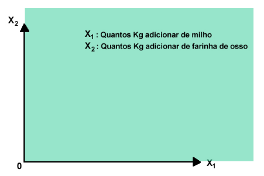

------

## Problema da mistura - Ração

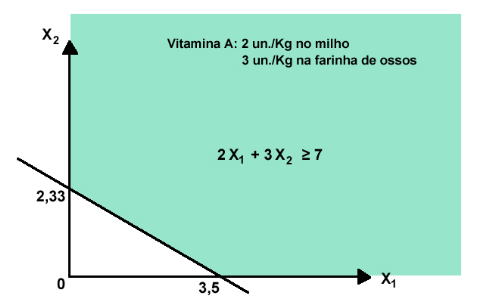

------

## Problema da mistura - Ração

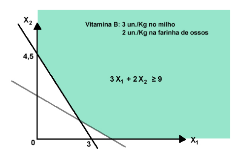

------

## Problema da mistura - Ração


------

## Problema da mistura - Ração

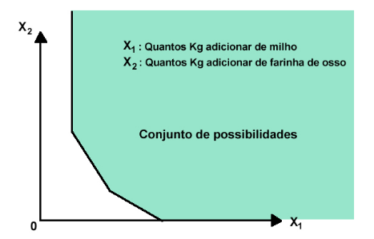

------

## Problema da mistura - Ração

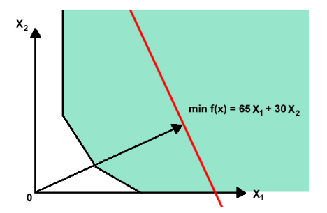

------

## Problema da mistura - Ração

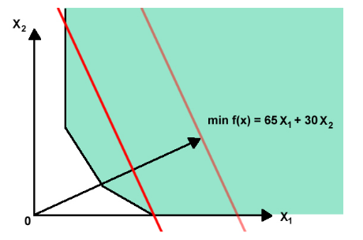

------

## Problema da mistura - Ração

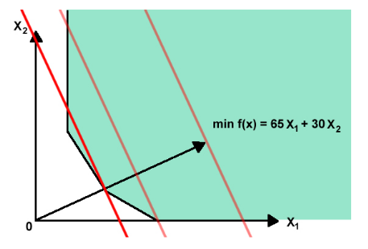

------

## Problema da mistura - Ração

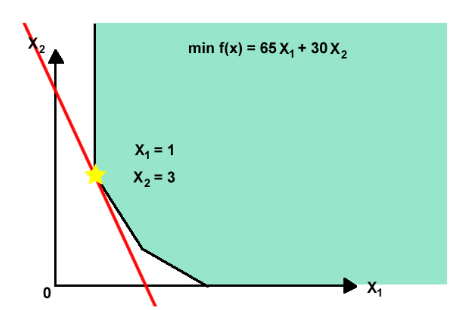


------

## Outras aplicações

- Ligas metálicas são produzidas a partir de vários insumos
(lingotes de ferro, grafite, sucatas industriais, entre outros).
- Cada insumo tem uma composição (quantidades de carbono,
silício, manganês etc) e custo conhecidos.
- A composição da liga é determinada por normas técnicas da
metalurgia (quantidades de carbono, silício, manganês etc).
- Deseja-se determinar as quantidades de cada insumo a serem
fundidas, satisfazendo as normas técnicas da metalurgia com
o menor preço final possível.

------

## OUTRAS APLICAÇÕES - Composição de areias para filtro

- Areias são usadas na constituição de filtros de Estações de
Tratamento de Águas de abastecimento;
- Diferentes tipos de areias com composições granulométricas
distintas estão disponíveis em vários locais;
- Custos de dragagem, transporte, seleção e preparo para
utilização de cada areia variam;
- Areias devem ser dispostas em camadas que devem obedecer
composições granulométricas estabelecidas por norma;
- O problema consiste em combinar os volumes de areia
provenientes de cada local de modo a atender às
especificações da norma, com o menor custo possível.


------

## Exemplo 2 - Barragem de concreto

- Na implantação de uma barragem de grande consumo de
concreto, decidiu-se utilizar como fontes de agregados
graúdos: Britas graníticas, seixos rolados e pedra britada
comercial.
- Os custos e as composições granulométricas de cada agregado
e a composição granulométrica ideal são dados no gráfico a
seguir.

-------

## Dados do problema da barragem de concreto


|              |                          |||                 |
| :---         | :---- | :---- | :----      | :----           |
| Faixas gran. |  Agregados Graúdos       ||| Comp. Ideal(%)  |
| ^            | Britas | Seixos | Pedras   | ^               |
| 2,4-19       | 0      | 0,05   | 0,20     | 0,10            | 
| 19-38        | 0,10   | 0,35   | 0,78     | 0,20            | 
| 38-76        | 0,20   | 0,60   | 0,02     | 0,35            | 
| 76-152       | 0,70   | 0      | 0        | 0,35            | 
| Custos       | $R\$6$ | $R\$7$ | $R\$18$  | $\;$            | 

**Variáveis de decisão:**\
$x_1$ = qde de britas graníticas ($m^3$);\
$x_2$ = qde de seixos rolados ($m^3$);\
$x_3$ = qde de pedras britadas comercial ($m^3$).

------

## Modelagem do exemplo do problema da barragem de concreto

$$ \min z(x 1 , x 2 , x 3 ) = 6x 1 + 7x 2 + 18x 3 $$

|        |           |          |         |          |
| :---   | :----     | :----    | :----   | :----    |
|        | 0,05x2    | + 0,20x3 | $\geq$  | 0,10     |
| 0,10x1 | + 0,35x2  | + 0,78x3 | $\geq$  | 0,20     |
| 0,20x1 | + 0,60x2  | + 0,02x3 | $\geq$  | 0,35     |
| 0,70x1 |           |          | $\geq$  | 0,35     |
|  x1    | + x2      | + x3     | $=$     | 1        |

$$ x1 \geq 0, x2 \geq 0, x3 \geq 0 $$


# O PROBLEMA DE PLANEJAMENTO DA PRODUÇÃO

------

## O Problema de Produção

- Função objetivo – maximizar a margem de contribuição dos
produtos;
- Primeiro conjunto de restrições – fabricação dos produtos
deve levar em conta a capacidade limitada dos recursos;
- Segundo conjunto de restrições – quantidade de produtos
produzida não deve ser inferior à mínima e nem superior à
máxima preestabelecida.

------

## Exemplo 1 - Problema de Produção

- Uma padaria produz dois tipos de produtos: pão ($P_1$) e massa
de pizza ($P_2$).
- Quatro diferentes matérias primas são utilizadas para a
fabricação destes produto: farinha ($M_1$), fermento ($M_2$), ovos ($M_3$) e manteiga ($M_4$), em que temos em estoque,
respectivamente, 60 unidades, 38 unidades, 18 unidades e 55
unidades.
- Para produzir 1 kg de pão são necessárias 1 un. de farinha, 2
un. de fermento e 3 un. de manteiga.
- Para produzir 1 kg de massa de pizza são necessárias 3 un. de
farinha, 1 un. de ovo e 1 un. de manteiga.

------

## Exemplo 1 - Problema de Produção

- O pão e massa de pizza são vendidos ao custo de $R\$ 22/Kg$ e
$R\$20/Kg$.
- Deseja-se determinar a quantidade de cada produto a ser
fabricada que maximize as vendas e respeite as restições de
estoque.

|               |                  ||           |
| :---          |   :---- | :----   | :----     |
| Matéria Prima |   Produto        ||  Estoque  |
| ^             |   P1    |  P2     |  ^        |
| Farinha       |  1      | 3       | 60        |
| Fermento      |  2      | 0       | 30        |
| Ovos          |  0      | 1       | 18        |
| Manteiga      |  3      | 1       | 55        |
| Custos ($R\$/kg$)  |  22  | 20  | $\;$        |


------

## Exemplo 1 - Problema de Produção

- O que devemos decidir?
- Decisões: Denominadas Variáveis de decisão.
- **Definindo:**
- $x_1$ =quantidade produzida de pão em kilos.
- $x_2$ =quantidade produzida de pizza em kilos.

------

## Modelagem do Exemplo 1 - Problema de Produção

**Modelo Matemático:**

$$ \max z(x_1 , x_2 ) = 22x_1 + 20x_2 $$

$$ 1 x1 + 3 x2 \leq 60 $$
$$ 2 x1 + 0 x2 \leq 30 $$
$$ 0 x1 + 1 x2 \leq 18 $$
$$ 3 x1 + 1 x2 \leq 55 $$

$$ x1 \geq 0, x2 \geq 0 $$


------

## Visualização do Modelo

*Próximas Imagens de [1]*

------

## Exemplo 1 - Problema de Produção

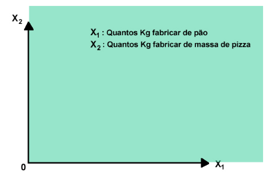

-------

## Exemplo 1 - Problema de Produção

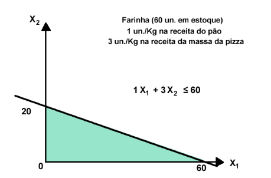

-------

## Exemplo 1 - Problema de Produção

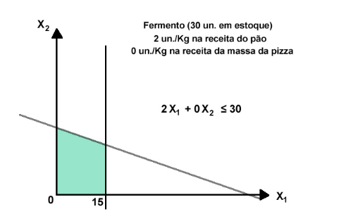

-------

## Exemplo 1 - Problema de Produção

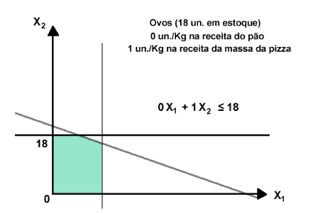

-------

## Exemplo 1 - Problema de Produção

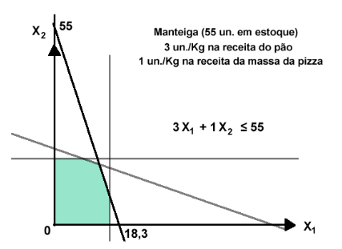

-------

## Exemplo 1 - Problema de Produção

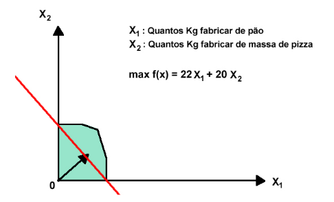

-------

## Exemplo 1 - Problema de Produção

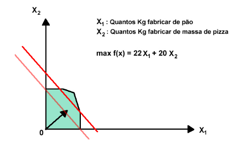

-------

## Exemplo 1 - Problema de Produção

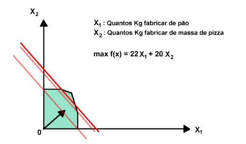

-------

## Exemplo 1 - Problema de Produção


------

## Exemplo 2 - Produção de geladeiras

- Empresa precisa decidir quais modelos de geladeira instalar em
sua nova planta;
- Dois possíveis modelos: luxo e básico.
- No máximo, 1500 unidades do modelo luxo e 6000 unidades
do modelo básico podem ser vendidas por mês.
- Empresa contratou 25000 homens-hora de trabalho por mês;
- Os modelos luxos precisam de 10 homens-hora de trabalho
para serem produzidos e os modelos básicos, 8 homens-hora.
- A capacidade da linha de montagem é de 4500 geladeiras por
mês, pois as geladeiras dividem a mesma linha;
- O lucro unitário do modelo luxo é $\$100,00$ por mês, enquanto
o modelo básico lucra $\$50,00$ durante o mesmo período.

------

## Exemplo 1 - Produção de geladeiras

- **Objetivo:** determinar quanto produzir de cada geladeira, de
modo a satisfazer todas as restrições e maximizar o lucro da
empresa.

**Variáveis de decisão:**

$x_1$ = quantidade de geladeiras do modelo luxo a ser produzida por mês.\
$x_2$ = quantidade de geladeiras do modelo básico a ser produzida por mês.


-------

## Modelo Matemático

**Modelo Matemático:**

$$ \max z(x_1 , x_2 ) = 100x_1 + 50x_2 $$


$$ 10x 1 + 8x 2 \leq 25000 $$
$$ x 1 + x 2 \leq 4500 $$
$$ 0 \leq x 1 \leq 1500 $$
$$ 0 \leq x 2 \leq 6000 $$

------

## Visualização do Modelo

*Próximas Imagens de [1]*

------

## Exemplo 1 - Problema de Produção

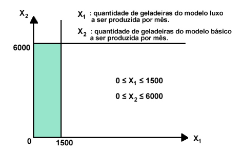

------

## Exemplo 1 - Problema de Produção

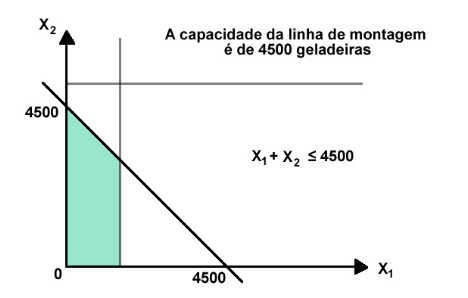

------

## Exemplo 1 - Problema de Produção


------

## Exemplo 1 - Problema de Produção

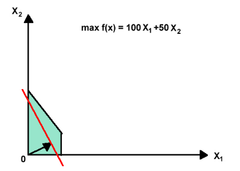

------

## Exemplo 1 - Problema de Produção

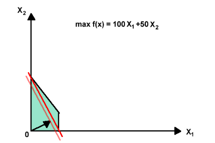

------

## Exemplo 1 - Problema de Produção

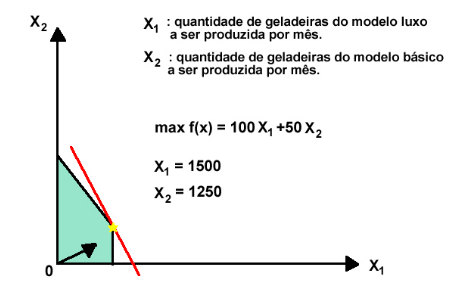

------

## Visualização Gráfica com Plotly

O que significam as três linhas vermelhas?

<!-- BEGIN COMMENT -->

```python {cmd=true hide=true}
from figs.fig_plotly_line1 import draw_fig
fig = draw_fig('figs/fig_plotly_model3.png')
```
<!-- @import "figs/fig_plotly_model3.png" -->

<!-- END COMMENT -->

<!-- BEGIN COMMENT TO revealjs -->
```{.plotly_python caption="Visualização Gráfica" width=350}
from figs.fig_plotly_line1 import draw_fig
fig = draw_fig('figs/fig_plotly_model3.png')
# nocache 7
```
<!-- END COMMENT TO revealjs -->

------

## Lista de Exercícios

A lista de exercícios está disponibilizada no site.
